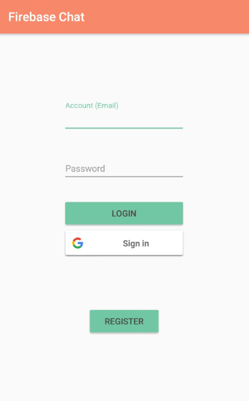
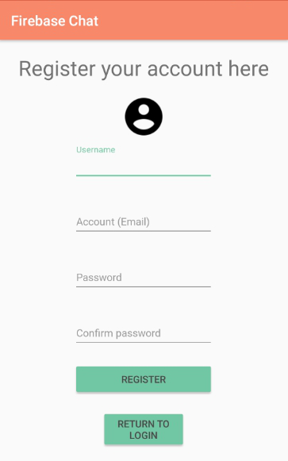
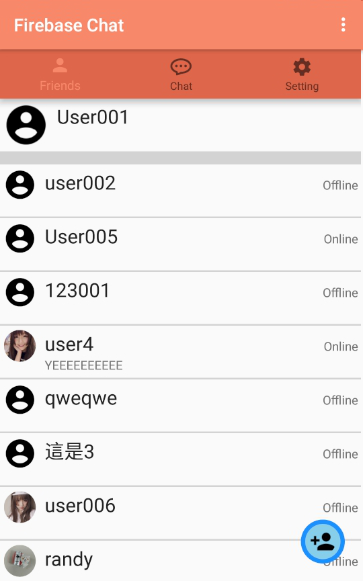
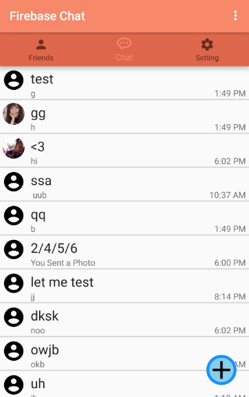
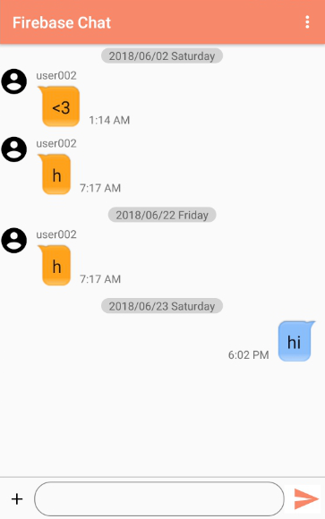
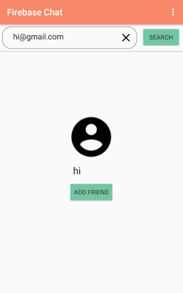

FirebaseChat
=====================

Introduction
---

FirebaseChat，一款 Android App  基於 Firebase Realtime Database 實作而成。
透過 FirebaseChat 註冊帳號之後，你可以和其他擁有 FirebaseChat 的使用者聊天，可以傳送文字或是圖片訊息甚至是建立群組達到多人聊天。

Prerequisites
---

- Android 5.0 (API 21) 含以上。
- 裝置相片讀取權限
- WiFi 或行動網路
- Google Play Services

系統架構設計
---

+ 基於 Android Studio 環境開發
+ buildToolsVersion = 27.0.3
+ 使用套件
    - [Google Play Services-Authentication_v15.0.1](https://developers.google.com/android/guides/overview) 取得 Google 帳號資訊(註冊/登入)
    - [Firebase Analytics_v15.0.1](https://firebase.google.com/docs/analytics/) 分析使用者資料，包括下載次數、Crash 報告、使用流量等等
    - [Firebase Realtime Database_v15.0.1](https://firebase.google.com/docs/database/) 支持 FirebaseChat  聊天室存取、使用者資料存取
    - [Firebase Storage_v15.0.2](https://firebase.google.com/docs/storage/) 用於存取使用者傳送到聊天室的圖片
    - [Firebase Authentication_v15.1.0](https://firebase.google.com/docs/auth/) 使用者帳戶存取

Download
---

Screenshots
---

初始頁面 - 帳號註冊與登入　　　註冊頁面　　　　　　　　　　好友頁面

 　　　　

聊天室檢視頁面　　　　　　　　聊天室頁面　　　　　　　　　好友搜尋頁面

 　　　　

建立群組頁面　　　　　　　　　編輯群組頁面

 　　

Contributors
---

[Rannddyyy](https://github.com/Rannddyyy)
 
[jimmy801](https://github.com/jimmy801)
 
[eedd778](https://github.com/eedd778)
 
[a348348333](https://github.com/a348348333)
